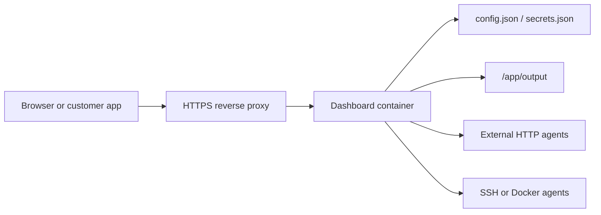

# Cloud Deployment

This guide turns the Dashboard into a private cloud service that can run local, remote, and HTTP agents behind a reverse proxy.

## Target Architecture



Keep the Dashboard private by default. Expose it only through HTTPS, authentication, and a trusted network or firewall.

## Docker Compose

From the repository root:

```powershell
Copy-Item deploy\dashboard.env.example deploy\dashboard.env
Copy-Item Dashboard\config.example.json deploy\data\config.json
Copy-Item Dashboard\secrets.example.json deploy\data\secrets.json
```

Edit `deploy\dashboard.env`:

- Set `DASHBOARD_PUBLIC_BASE_URL` to the final HTTPS URL.
- Replace `DASHBOARD_AUTH_PASSWORD` and `DASHBOARD_API_TOKEN`.
- Keep `DASHBOARD_REQUIRE_AUTH=true` for any cloud deployment.
- Set `DASHBOARD_CORS_ORIGIN` only when a separate frontend or customer app calls the API from a browser.

Start:

```powershell
docker compose -f deploy\docker-compose.yml up -d --build
docker compose -f deploy\docker-compose.yml ps
```

Health check:

```powershell
$headers = @{ Authorization = "Bearer <your-token>" }
Invoke-RestMethod http://127.0.0.1:3456/api/health -Headers $headers
```

## Reverse Proxy

Put Nginx, Caddy, Cloudflare Tunnel, Traefik, or a cloud load balancer in front of the container.

Proxy to:

```text
http://127.0.0.1:3456
```

Recommended headers:

```text
Host
X-Forwarded-For
X-Forwarded-Proto
X-Forwarded-Host
```

Set:

```env
DASHBOARD_TRUST_PROXY=true
DASHBOARD_PUBLIC_BASE_URL=https://dashboard.example.com
```

## External Agent Integration

For agents hosted outside the Dashboard machine, prefer the `http` adapter. Each external agent should provide a JSON endpoint that accepts a compiled prompt and returns text output.

Example `deploy\data\config.json` agent:

```json
{
  "id": "research-http",
  "name": "Research Agent",
  "type": "http",
  "adapter": "http",
  "endpoint": "https://agents.example.com/research/run",
  "method": "POST",
  "headers": {
    "Authorization": "Bearer ${RESEARCH_AGENT_TOKEN}"
  },
  "requestTemplate": {
    "input": "{{prompt}}"
  },
  "responsePath": "output",
  "chatTimeout": 120000
}
```

Add `RESEARCH_AGENT_TOKEN` to `deploy\dashboard.env`.

Validate before restart:

```powershell
Invoke-RestMethod http://127.0.0.1:3456/api/v1/config/validate -Headers $headers
```

## Multi-Agent Collaboration API

Use this endpoint when a customer app needs several agents to work on one request.

```http
POST /api/v1/collaborations
Authorization: Bearer <token>
Content-Type: application/json
```

```json
{
  "agent_ids": ["research-http", "writer-http"],
  "input": "Create a launch plan for a new AI dashboard product.",
  "topic": "launch-plan",
  "mode": "parallel",
  "summarizer_agent_id": "writer-http",
  "async": true,
  "metadata": {
    "workspace_id": "demo"
  }
}
```

Poll the returned run with:

```http
GET /api/v1/runs/{run_id}
Authorization: Bearer <token>
```

The completed run includes a `responses` array with each agent result and a final `output`.

## Production Checklist

- Use a private GitHub repository and do not commit `deploy\dashboard.env`, `config.json`, `secrets.json`, or generated output.
- Rotate tokens before inviting real customers.
- Keep `DASHBOARD_REQUIRE_AUTH=true`.
- Restrict inbound traffic to HTTPS and known IP ranges when possible.
- Use separate agent tokens per customer or workspace.
- Back up `deploy\data\output\api_runs.json` and audit logs if they matter for billing or support.
- Review `docs/SECURITY.md` before public exposure.
